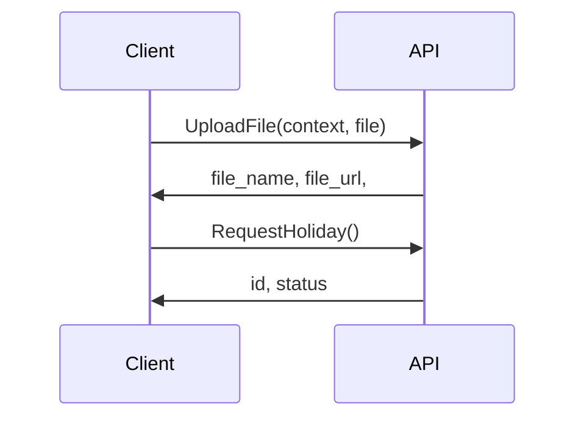

# Node.js BootCamp @ LKPP

## Upload File

1. 1 API untuk upload file
  - `context`

### Case: Pengajuan Cuti

### Contoh

1 = Cuti: Surat Sakit/Surat Tugas
2 = Data Pegawai: KTP, = Foto Profile
3 = Data Pegawai: Dokumen

#### Request

Upload
POST /assets?context=1

Pengajuan Cuti
POST /cuti
{
  start
  end
  attached_files: [

  ]
}
#### Response

{
  whi
  url
  checksum
  chucksum_type
}

1. Upload file
2. 

