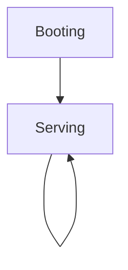
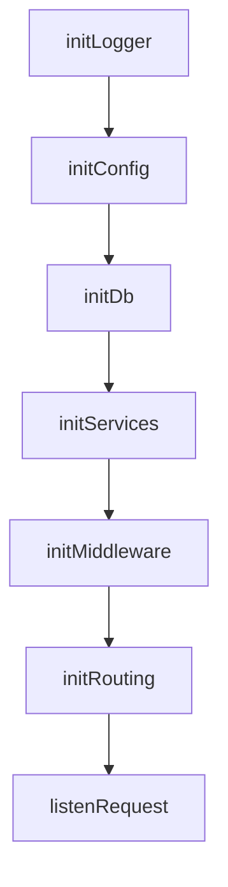
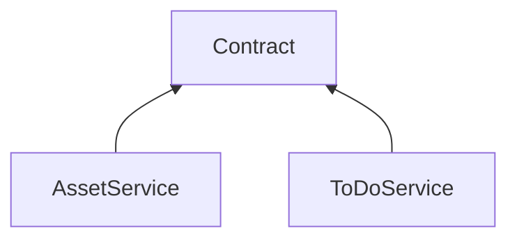
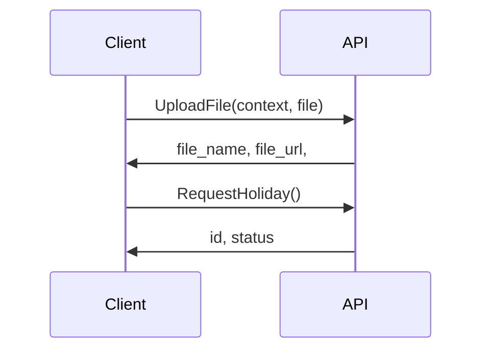

# Node.js BootCamp @ LKPP

## App

### Lifecycle

```mermaid
graph TD;
  booting[Booting] --> serving[Serving]
  serving --> serving
```

#### Booting

```mermaid
graph TD;
  initLogger --> initConfig
  initConfig --> initDb
  initDb --> initServices
  initServices --> initMiddleware
  initMiddleware --> initRouting
  initRouting --> listenRequest
```

#### Dependency

```mermaid
graph BT;
  AssetService --> Contract
  ToDoService --> Contract
```

## Upload File

1. 1 API untuk upload file
  - `context`

### Case: Pengajuan Cuti

```mermaid
sequenceDiagram
  participant C as Client
  participant A as API
  C ->> A: UploadFile(context, file)
  A ->> C: file_name, file_url, 
  C ->> A: RequestHoliday()
  A ->> C: id, status 
```